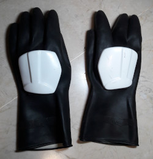
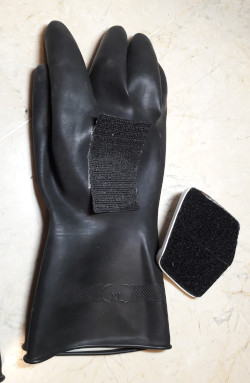

# Los guantes de Trooper

Los guantes que vienen con el traje original de Trooper tienen los
siguientes inconvenientes:
* No permiten tener sensación de tacto.
* No permiten transpirar y por tanto con el tiempo huelen mal.
* No se pueden limpiar/lavar con facilidad porque son de plástico duro.
* Además si los dejas secando al sol... pierden su color.

Por estos motivos se hace necesario conseguir otros guantes.
Además nunca viene mal tener 2 pares de guantes por si hay un imprevisto.

---

# Partes

Los guantes tienes dos partes: el guante en sí, unas placas blancas de plástico duro que forman parte de la armadura. Estas dos partes están unidas mediante un velcro negro. Por lo que la armadura blanca se puede quitar y poner.

---

# Nuevo guante barato

En mi caso fuí a una ferretaría y compré unos guantes negros, que pudiera tener tacto y que se les pudiera pegar un velcro.

Fuí a un chino a comprar velcro adhesivo negro, que corte según me convenía y que luego pegué en el guante. ¡Listo!

---

# Futuro

En el futuro, teniendo algo de dinero trataré de encargar unos que sean más "profesionales".
